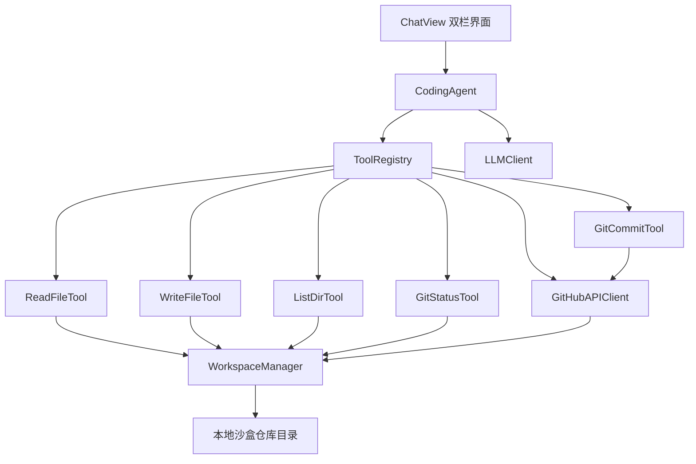

# Git AI Coding Agent

Feature Name: git-ai-coding-agent
Updated: 2026-08-14

## Description

在 AIReverse iOS App 中新增「Git 仓库 AI 编码助手」：支持导入本地目录或通过 GitHub API 拉取远程仓库，提供文件浏览/代码阅读/常用 Git 操作，并通过聊天式 AI（OpenAI 兼容 LLM）直接读取、修改代码并提交变更。聊天界面采用「聊天 + 代码双栏」的 opencode 风格。

关键约束：设备（越狱/TrollStore）上不一定有 git 二进制，因此 git 元数据计算使用**本地文件状态 + 轻量 Git 状态解析**，远端同步（push/pull）通过 **GitHub REST API** 完成。

## Architecture



### 说明

- **WorkspaceManager**：管理工作区根目录（沙盒 Documents/Workspace 下），提供安全的路径解析（防 `..` 逃逸）、文件树枚举、文本文件读写。
- **CodingAgent**：对话编排器。将用户消息 + 文件清单 + 工具定义发送给 LLM；解析模型返回中的工具调用，逐一执行并把结果回传，直到模型产出最终回答。
- **ToolRegistry**：工具定义与分发的注册表，每个工具声明 name / description / parameters（JSON Schema），供 LLM 调用。
- **GitStatusTracker**：轻量 Git 状态计算。维护本地文件清单 + 上次提交快照（JSON 存储），对比计算 added/modified/deleted/untracked。
- **GitHubAPIClient**：封装 GitHub REST API（Contents / Commits / Trees / Branches / PullRequests），用于 clone、push、pull、branch 管理。

## Components and Interfaces

### WorkspaceManager

```
final class WorkspaceManager {
    var workspaceRoot: URL
    func resolve(_ relativePath: String) throws -> URL   // 防路径逃逸
    func listFiles(relativeTo dir: String) -> [WorkspaceEntry]
    func readText(_ relativePath: String) throws -> String
    func writeText(_ relativePath: String, content: String) throws
    func delete(_ relativePath: String) throws
    func snapshot() -> WorkspaceSnapshot   // 文件路径 + 修改时间 + 哈希
}
```

### CodingAgent

```
final class CodingAgent: ObservableObject {
    @Published var messages: [CodingMessage]
    @Published var toolCalls: [ToolCallCard]
    func send(_ userText: String) async
    func cancel()
}
```

### 工具协议

```
protocol CodingTool {
    var name: String { get }
    var description: String { get }
    var parameters: [String: Any] { get }   // JSON Schema
    func execute(arguments: [String: Any]) async throws -> String
}
```

内置工具：

| 工具 | 名称 | 说明 |
|------|------|------|
| 读文件 | read_file | 读取文本文件（可带行范围） |
| 写文件 | write_file | 写入文件（记录原备份） |
| 列目录 | list_dir | 列出目录下条目 |
| Git 状态 | git_status | 显示改动文件 |
| Git 提交 | git_commit | 提交改动到当前分支（调用 GitHub API） |
| Git 分支 | git_branch | 分支列表/创建 |
| Git 日志 | git_log | 提交历史 |
| 仓库概览 | repo_overview | 文件树 + 大小摘要 |

### LLM 工具调用协议

LLM 返回标准 OpenAI 格式的 `tool_calls`：

```json
{
  "choices": [{
    "message": {
      "role": "assistant",
      "tool_calls": [{
        "id": "call_1",
        "type": "function",
        "function": {
          "name": "read_file",
          "arguments": "{\"path\":\"Sources/main.swift\"}"
        }
      }]
    }
  }]
}
```

LLMClient 扩展 `chatWithTools(model:messages:tools:)`，支持解析 tool_calls 并返回结构化消息。

## Data Models

### CodingMessage

```
struct CodingMessage: Identifiable {
    enum Role { case user, assistant, system, tool }
    let id: UUID
    var role: Role
    var content: String
    var toolCallID: String?      // tool 结果回传时使用
    var name: String?            // tool 名称
}
```

### ToolCallCard

```
struct ToolCallCard: Identifiable {
    let id: String               // call_1
    let name: String             // read_file
    let argumentsText: String
    let status: ToolStatus       // running / success / failed
    let resultPreview: String?
}
```

### WorkspaceEntry

```
struct WorkspaceEntry: Identifiable {
    let name: String
    let path: String             // 相对路径
    let isDirectory: Bool
    let size: Int
    let modifiedAt: Date
}
```

### WorkspaceSnapshot

```
struct WorkspaceSnapshot: Codable {
    var files: [String: FileState]   // 相对路径 -> 状态
    var branch: String
    var remoteURL: String?
    var commitHash: String
}
```

## Correctness Properties

- 工作区所有路径解析必须通过 `WorkspaceManager.resolve`，拒绝 `..`、绝对路径、symlink 逃逸；违反时抛错并中止工具。
- `write_file` 必须原子写入（先写临时文件再替换），并在写入前备份原文件到 `.ai_backup/`。
- AI 未开启「允许修改」开关时，修改类工具（write_file、git_commit）必须在执行前被拒绝。
- `git_commit` 必须顺序执行：GitHub API 创建 blob → 创建 tree → 创建 commit → 更新 ref，任一步失败回滚提示，不得产生半提交状态。
- 聊天上下文有长度上限；工具返回内容过大时截断（默认单次 8000 字符）并告知 AI。

## Error Handling

| 场景 | 处理 |
|------|------|
| GitHub API 返回 401 | 提示 Token 无效或已过期，引导重新配置 |
| GitHub API 返回 409（冲突） | 提示远端已更新，建议先 pull 或手动处理 |
| 文件写入失败（权限/磁盘满） | 回传错误给 AI，界面 toast 提示 |
| 路径逃逸尝试 | 拒绝执行，返回「非法路径」错误 |
| LLM 返回非法工具调用 | 忽略该调用，请求 AI 重新描述 |
| 仓库不存在 / 未配置 | 工具返回明确错误，界面引导导入仓库 |

## Test Strategy

- 单元测试：
  - `WorkspaceManager.resolve` 的路径逃逸用例（`..`、绝对路径、空路径）。
  - `WorkspaceSnapshot` 快照对比产生 added/modified/deleted 的正确性。
  - `GitStatusTracker` 对临时构造的改动目录的状态计算。
  - `GitHubAPIClient` 的请求构造与响应解析（mock URLProtocol）。
- 集成测试：
  - 导入本地目录 → 浏览文件树 → 读文件 → AI 修改 → git_commit 全链路（mock GitHub API）。
- 真机验证：
  - TrollStore 环境导入仓库、AI 读/写文件、GitHub push 到测试仓库。
  - 「允许修改」开关对工具执行的拦截行为。

## References

- (Web) - [GitHub REST API - Contents](https://docs.github.com/en/rest/repos/contents)
- (Web) - [GitHub REST API - Git Data](https://docs.github.com/en/rest/git)
- (Web) - [OpenAI Function Calling](https://platform.openai.com/docs/guides/function-calling)
